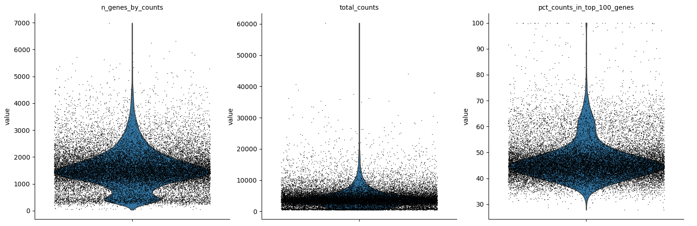
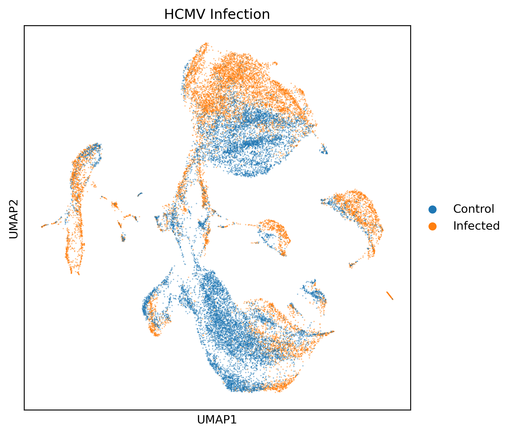
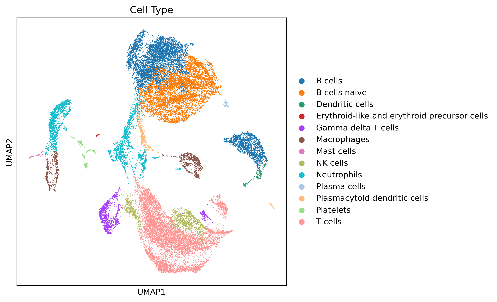
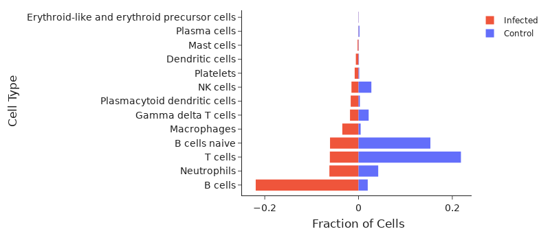

# Quickstart

If you have apptainer, this is all you need.

```bash
apptainer run docker://quay.io/rtcai/ctap ctap -resume
```

# Introduction

### CTAP: Cell Type Annotation Pipeline
by Runtong Cai  
for BIOF 501 project

### *Background & Rationale*
Single cell RNA (scRNA) sequencing enables the viewing of gene expression patterns on a cell by cell basis, which communicates the function and intent of individual cells from within a possibly heterogeneous population. Observing the space of possible expression patterns will reveal prevalent distributions, otherwise known as cell types. It is important to model cell types not as distinct categories, but rather as relatively dense regions within an otherwise continuous landscape. Time-aware pathfinding between cell types can be used to infer the developmental trajectories of cells as they reach maturity from stem cells to senescence. A continuous model also provides the resolution to map expression responses from environmental stimuli, perturbations, that are distinct from differences in cell type. This ability to identify cell types and adjacent gene expression patterns is applicable to a wide variety of situations, including forensics [(1)](#bibliography), pathogen detection [(2)](#bibliography), and monitoring disease progress [(3)](#bibliography). Perhaps the simplest method for assigning cell types is through the use of canonical cell surface markers during flow cytometry[(4)](#bibliography), but more sophisticated tools have since been developed to integrate more genes into the classification process. Seurat [(5)](#bibliography) and Monocle [(6)](#bibliography) are examples of popular toolkits for this purpose, integrating many statistical, heuristic, and machine learning modules. With the widespread success of deep learning approaches centered around the breakthrough technology of the attention mechanism and transformers [(7)](#bibliography), modern approaches like TOSICA [(8)](#bibliography) and scGPT [(9)](#bibliography) have pushed the performance in cell type mapping even further.

To demonstrate the utility of cell type annotation, a dataset consisting of single cell RNAseq count data of peripheral mononuclear blood cells (PBMC) was sourced from Wang and colleagues as part of their publication [(10)](#bibliography). The dataset was generated by infecting humanized mouse models with human cytomegalovirus (HCMV) and obtaining single cell transcripomics of PBMC samples.

### *Aim*
The purpose of this pipeline is to demonstrate and automate a cell type annotation pipeline to investigate the effect of HCMV infection on PBMC cell populations in a humanized mouse model.

### *Dependencies*
CTAP is completely packaged as a container. Please install **one** of the following through the provided links:
- Docker [install guide](https://docs.docker.com/engine/install/)
- Apptainer [install guide](https://apptainer.org/docs/admin/main/installation.html)

For operating systems, only `Ubuntu` and `MacOS` were tested. Docker may enable execution of CTAP on windows, but this is untested.

### *Workflow*


CTAP is broken up into 7 steps orchestrated by nextflow:

1. **Extract HCMV**: the compressed dataset is extracted
0. **Load inital adata**: the raw dataset is loaded into an anndata object called "adata"
0. **QC**: scanpy is used to visualize count distributions
0. **Log normalize counts**: scanpy is used to normalize counts to ln(count + 1)
0. **UMAP embed**: uniform manifold approximation (UMAP) is used to reduce the dimensionality of the dataset to 2 for visualization
0. **Predic cell types**: cells are clustered and annotated by cell type using marker genes provided by [PanglaoDB](https://doi.org/10.1093/database/baz046). Over representation analysis then assigns the cell type of each cluster.
0. **Compare cell populations**: the relative fraction of each cell type in infected and control samples is compared.


# Usage

All inputs, software dependencies, and reference data of CTAP are packaged in the container. The workflow is executable using a single command with *either* Apptainer or Docker ([installation instructions](#Dependencies)). In either case, the container engine will download the CTAP image and run the pipeline in the current directory.

### *Apptainer*
In a bash terminal run the following:
```bash
apptainer run docker://quay.io/rtcai/ctap ctap -resume
```
The command tells apptainer to load the docker image (`docker://`) from `quay.io/rtcai/ctap` and run the preconfigured entrypoint `ctap` **in the current working directory**. The last flag `-resume` lets nextflow look for previous runs in the current folder and continue their execution if stopped prematurely. The flag is ignored if running CTAP for the first time.

### *Docker*
In a bash terminal run the following:
```bash
docker run -it --rm \
    -u $(id -u):$(id -g) \
    --mount type=bind,source="./",target="/ws" \
    --workdir="/ws" \  
    quay.io/rtcai/ctap ctap -resume
```
Explanation of arguments:
- `-it` specifies that ctap requires an interactive (`-i`) tty (`-t`) terminal so that nextflow's outputs are displayed correctly
- `--rm` removes the container instance after execution (the image is retained). Docker creates a new instance of the container image each time it is used.
- `-u $(id -u):$(id -g)` run as current user instead of the default `root` user
- `--mount type=bind,source="./",target="/ws"` mount the current working directory (`./`) as `/ws` in the container
- `--workdir="/ws" \` after entering the container, set the current working directoy to `/ws`
- use the container image `quay.io/rtcai/ctap`
- run the preconfigured entry point `ctap`
- `-resume` lets nextflow look for previous runs in the current folder and continue their execution if stopped prematurely. If this is the first run, it is ignored.

> [!NOTE]  
> If `docker` encounters permission issues, the following may help:
> - try `sudo docker ...` instead
> - [follow this guide](https://docs.docker.com/engine/install/linux-postinstall/) to remove docker's root privilege requirements
> - try apptainer

# Input

Single cell RNAseq count data and associated metadata were obtained from the Gene Expression Omnibus (GEO) using the accession [GSE267869](https://www.ncbi.nlm.nih.gov/geo/query/acc.cgi?acc=GSE267869). The dataset contains 4 PBMC samples of HCMV infection in a humanized mouse model, 2 control and 2 infected. For each sample, a count matrix of cells by genes is provided. 2 accompanying dataframes provide metadata for each matrix axis. `{sample}-barcodes.tsv` identify each row as a cell using unique molecular identifier (UMI) barcodes. `{sample}-features.tsv` indicate the genes of each column by name and Ensembl ID. In total there are 25312 cells by 36601 genes.

The compressed input files can be found in the container at `/data/GSE267869_Processed_data_files.tar.gz`. If extracted, they will be structured in the following way, where `sample` is one of: HCMV1, HCMV2, mock1, mock2. 
```
GSE267869/
├─ {sample}-barcodes.tsv
├─ {sample}-features.tsv
├─ {sample}-matrix.mtx
```

# Output

Expected outputs can be found in this repo at `./example_outputs` and in the container at `/example_results`. For convienience, the example results folder can be exported to the current working directory using apptainer
```bash
apptainer run docker://quay.io/rtcai/ctap example
```

or using docker
```bash
docker run -it --rm \
    -u $(id -u):$(id -g) \
    --mount type=bind,source="./",target="/ws" \
    --workdir="/ws" \  
    quay.io/rtcai/ctap example
```
and is expected to have the following structure.
```
example_results/
├─ adata.final.h5ad
├─ counts_distribution.png
├─ umap_infection_vs_control.png
├─ umap_celltypes.png
├─ compare_cell_populations.png
```
When executing the pipeline, the `example_results` folder will instead be named `ctap_results` and contain an additional `nextflow_work` folder managed by nextflow.

### *adata.final.h5ad*

This data object is created by [anndata](https://anndata.readthedocs.io/en/stable/) and contains the accumulated data over the workflow's execution and is sufficient to recreate all figures. The version provided in this repo is subsampled due to size limitations by github. The full size of `adata.final.h5ad` is 1.4 GB.

### *counts_distribution.png*


From left to right:

- each gene typically has a count of 1500
- each sample typically has a total count of 5000, though extreme outlier exist
- about 45% of counts for each cell belong to the same top 100 genes

### *umap_infection_vs_control.png*



Infected and healthy (control) cells are placed in differnt locations in the umap embedding, indicating a change in expression profile due to infection.

### *umap_celltypes.png*


The B cell and naive B cell clusters at the top overlap well with infected and health regions of the previous figure, indicating a mobilization of B cells. The large T cell population at the bottom correspond to mostly healthy cells.

### *compare_cell_populations.png*


The fraction of cells in infected and healthy samples belonging to each cell type clearly shows a population shift towards B cells and a corresponding decrease in T cells and naive B cells. This suggests that a humoral response is an effect of HCMV infection. 

# Bibliography

1.	Sijen T. Molecular approaches for forensic cell type identification: On mRNA, miRNA, DNA methylation and microbial markers. Forensic Sci Int Genet. 2015;18:21–32. https://doi.org/10.1016/j.fsigen.2014.11.015
2.	Huang W, Wang D, Yao YF. Understanding the pathogenesis of infectious diseases by single-cell RNA sequencing. Microb Cell. 2021;8(9):208–22. https://doi.org/10.15698/mic2021.09.759
3.	Ding S, Chen X, Shen K. Single-cell RNA sequencing in breast cancer: Understanding tumor heterogeneity and paving roads to individualized therapy. Cancer Commun. 2020;40(8):329–44. https://doi.org/10.1002/cac2.12078
4.	McKinnon KM. Flow Cytometry: An Overview. Curr Protoc Immunol. 2018;120(1):5.1.1-5.1.11. https://doi.org/10.1002/cpim.40
5.	Butler A, Hoffman P, Smibert P, Papalexi E, Satija R. Integrating single-cell transcriptomic data across different conditions, technologies, and species. Nat Biotechnol. 2018;36(5):411–20. https://doi.org/10.1038/nbt.4096
6.	Trapnell C, Cacchiarelli D, Grimsby J, Pokharel P, Li S, Morse M, et al. The dynamics and regulators of cell fate decisions are revealed by pseudotemporal ordering of single cells. Nat Biotechnol. 2014;32(4):381–6. https://doi.org/10.1038/nbt.2859
7.	Vaswani A, Shazeer N, Parmar N, Uszkoreit J, Jones L, Gomez AN, et al. Attention is all you need. 2017.  https://doi.org/10.48550/arXiv.1706.03762
8.	Chen J, Xu H, Tao W, Chen Z, Zhao Y, Han JDJ. Transformer for one stop interpretable cell type annotation. Nat Commun. 2023;14(1):223. https://doi.org/10.1038/s41467-023-35923-4
9.	Cui H, Wang C, Maan H, Pang K, Luo F, Duan N, et al. scGPT: toward building a foundation model for single-cell multi-omics using generative AI. Nat Methods. 2024;21(8):1470–80. https://doi.org/10.1038/s41592-024-02201-0
10.	Wang A, Zhu XX, Bie Y, Zhang B, Ji W, Lou J, et al. Single-cell RNA-sequencing reveals a profound immune cell response in human cytomegalovirus-infected humanized mice. Virol Sin. 2024;39(5):782–92. https://doi.org/10.1016/j.virs.2024.08.006